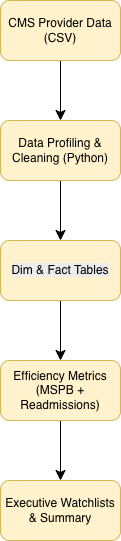

# CMS Hospital Efficiency & Cost Effectiveness Analytics
📊 **Executive-ready healthcare analytics project using public CMS Provider Data**

A real-world healthcare analytics project using **CMS Provider Data** 
to evaluate
hospital cost efficiency and care outcomes. This project demonstrates 
how a data
analyst translates public healthcare metrics into **executive-ready 
insights**
that support operational decision-making.

---

## Overview

Hospitals vary widely in how efficiently they deliver care and manage 
patient
transitions. Using CMS-published measures, this project identifies 
hospitals
that are:

- High cost relative to peers
- High risk for excess readmissions
- Strong performers worth benchmarking

The analysis emphasizes **clarity over complexity** and ensures the 
**“so what”**
is immediately visible to non-technical stakeholders.

---

## Key Business Questions

- Where is Medicare spending **higher than expected**?
- Which hospitals combine **high cost and high readmissions**?
- Where should leadership prioritize **operational reviews**?
- Which hospitals demonstrate **efficient, high-value care**?

---

## Data Sources (CMS)

All data comes directly from **CMS Provider Data** and is publicly 
available.

Primary datasets:
- Hospital General Information
- Medicare Spending Per Beneficiary (MSPB)
- Hospital Readmissions Reduction Program (HRRP)
- Complications and Deaths Measures

Detailed citations and links are documented in:
```
docs/SOURCES.md
```

---

## Architecture


**Pipeline flow:**

Raw CMS CSVs  
→ Dimension & fact tables  
→ Facility-level efficiency metrics  
→ Executive summary & watchlists  

(See `architecture/` for ER diagrams and design notes.)

---

## Core Metrics

- **MSPB (Medicare Spending Per Beneficiary)**  
  Relative cost of care for a Medicare episode  
  > 1.00 = higher than expected cost

- **Excess Readmission Ratio**  
  Observed vs expected readmissions  
  > 1.00 = worse than expected outcomes

---

## Executive Summary (So What)

Hospitals in the **top quartile for both MSPB and readmissions**
represent the **highest operational risk**.

These facilities are prime candidates for:
- Care transition redesign
- Discharge planning improvements
- Post-acute coordination reviews

Outputs include:
- High-risk hospital watchlist
- Cost outliers
- Readmission outliers
- Benchmark hospitals with strong performance

All summaries are generated automatically and written to:
```
reports/generated/
```

---

## Project Structure

```
cms-hospital-efficiency-analytics/
│
├── data/
│   ├── raw/            # Original CMS datasets
│   └── processed/      # Cleaned dimension & fact tables
│
├── scripts/            # Reproducible analysis pipeline
├── analysis/           # Facility-level efficiency tables
├── reports/generated/  # Executive summaries & CSV outputs
├── architecture/       # ER diagrams & design notes
├── docs/               # Sources, assumptions, methodology
└── README.md
```

---

## Reproduce the Analysis (Local)

### Prerequisites
- Python 3.10+
- macOS / Linux / WSL
- No database required (CSV-based pipeline)

### Setup & Run
```bash
python3 -m venv .venv
source .venv/bin/activate
pip install -r requirements.txt

python scripts/01_profile_raw_data.py
python scripts/02_build_hospital_master.py
python scripts/03_build_fact_mspb.py
python scripts/05_build_efficiency_base.py
python scripts/07_generate_exec_summary.py
```

---

## Caveats & Assumptions

- CMS metrics are **risk-adjusted** but still influenced by case mix
- Not all hospitals report all measures
- Results support **prioritization**, not definitive judgment
- Quartile-based thresholds ensure stability across refreshes

---

## Skills Demonstrated

- Healthcare analytics (CMS, MSPB, HRRP)
- SQL-style dimensional modeling in Python
- Executive-level storytelling
- Reproducible data pipelines
- Translating metrics into operational decisions

---

## Author

Bright Uchehara  
Industrial & Systems Engineering · Data Analytics  
Microsoft Power BI Data Analyst Associate  
Google Data Analytics Professional Certificate

